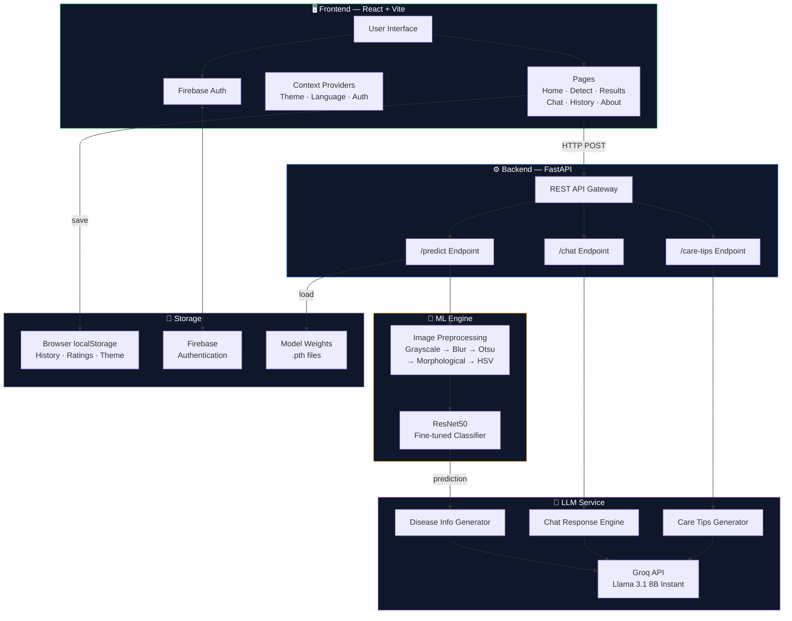
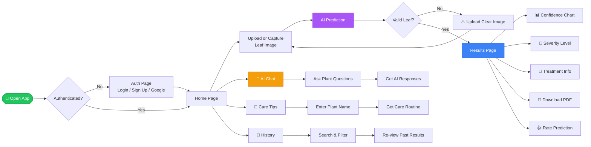

<div align="center">

# 🌿 Croply AI

### AI-Powered Plant Health Platform

[](https://python.org)
[](https://react.dev)
[](https://fastapi.tiangolo.com)
[](https://pytorch.org)
[](https://tailwindcss.com)

**Upload a leaf image → Get instant AI disease diagnosis, severity scoring, treatment plans, and chat with an intelligent plant health assistant.**

[Getting Started](#-getting-started) · [Architecture](#-system-architecture) · [Features](#-features) · [API Reference](#-api-reference)

</div>

---

## 📋 Table of Contents

- [Features](#-features)
- [System Architecture](#-system-architecture)
- [User Flow](#-user-flow)
- [ML Pipeline](#-ml-pipeline)
- [Tech Stack](#-tech-stack)
- [Getting Started](#-getting-started)
- [API Reference](#-api-reference)
- [Model Architecture](#-model-architecture)
- [Project Structure](#-project-structure)
- [License](#-license)
- [Acknowledgements](#-acknowledgements)

---

## ✨ Features

| Category | Feature | Description |
|----------|---------|-------------|
| **AI/ML** | Disease Detection | Fine-tuned ResNet50 with custom preprocessing pipeline |
| **AI/ML** | Severity Scoring | Color-coded severity levels (Mild / Moderate / Severe) |
| **AI/ML** | Confidence Breakdown | Visual bar chart of top prediction probabilities |
| **AI/ML** | Image Validation | Auto-detects unclear / irrelevant uploads and prompts for a clearer image |
| **LLM** | Chat Assistant | Natural-language plant health Q&A via Groq Llama 3.1 |
| **LLM** | Treatment Plans | Structured disease info with symptoms, causes & remedies |
| **LLM** | Plant Care Tips | AI-generated daily/weekly care routines |
| **UX** | Camera Capture | Open device camera & capture a leaf photo directly in-app |
| **UX** | Multi-Language | 8 languages — EN, HI, ES, FR, DE, PT, ZH, AR |
| **UX** | PDF Reports | Downloadable professional plant health reports |
| **UX** | Prediction History | Searchable local history with rating & re-view |
| **UX** | Dark / Light Mode | Theme toggle with smooth CSS transitions |
| **Auth** | Firebase Auth | Email/password + Google OAuth sign-in |
| **Design** | Animations | Framer Motion page transitions & micro-interactions |

---

## 🏗 System Architecture



---

## 🔄 User Flow



---

## 🔬 ML Pipeline

```mermaid
flowchart LR
    subgraph Preprocessing ["Image Preprocessing"]
        A[📸 Raw Image] --> B[Grayscale Conversion]
        B --> C[Gaussian Blur<br/>σ = auto]
        C --> D[Otsu's Threshold<br/>Binary segmentation]
        D --> E[Morphological Close<br/>5×5 kernel]
        E --> F[HSV Conversion]
        F --> G[Resize 224×224<br/>+ Normalize]
    end

    subgraph Inference ["Model Inference"]
        G --> H[ResNet50 Backbone<br/>ImageNet pre-trained]
        H --> I[Custom FC Head<br/>2048→1024→N classes]
        I --> J[Softmax<br/>Probabilities]
    end

    subgraph Output ["Results"]
        J --> K[🏷️ Disease Class]
        J --> L[📊 Confidence %]
        K --> M[🤖 LLM Disease Info]
    end

    style Preprocessing fill:#0f172a,stroke:#22c55e,color:#fff
    style Inference fill:#0f172a,stroke:#3b82f6,color:#fff
    style Output fill:#0f172a,stroke:#f59e0b,color:#fff
```



---

## 🛠 Tech Stack

<table>
<tr><th>Layer</th><th>Technology</th><th>Purpose</th></tr>
<tr><td><b>Frontend</b></td><td>React 19 · Vite 7 · Tailwind CSS 3</td><td>SPA with utility-first styling</td></tr>
<tr><td><b>UI/UX</b></td><td>Framer Motion · Recharts · React Icons</td><td>Animations, charts, iconography</td></tr>
<tr><td><b>State</b></td><td>React Context · localStorage</td><td>Auth, theme, language, history</td></tr>
<tr><td><b>Auth</b></td><td>Firebase Authentication</td><td>Email/password + Google OAuth</td></tr>
<tr><td><b>Backend</b></td><td>Python · FastAPI · Uvicorn</td><td>Async REST API server</td></tr>
<tr><td><b>ML</b></td><td>PyTorch · torchvision · OpenCV</td><td>Image classification pipeline</td></tr>
<tr><td><b>LLM</b></td><td>Groq API · Llama 3.1 8B Instant</td><td>Disease info, chat, care tips</td></tr>
<tr><td><b>PDF</b></td><td>jsPDF</td><td>Client-side report generation</td></tr>
<tr><td><b>Markdown</b></td><td>react-markdown</td><td>Rich chat message rendering</td></tr>
</table>

---

## 🚀 Getting Started

### Prerequisites

| Requirement | Version | Download |
|-------------|---------|----------|
| Python | 3.8+ | [python.org](https://www.python.org/downloads/) |
| Node.js | 18+ | [nodejs.org](https://nodejs.org/) |
| Git | Latest | [git-scm.com](https://git-scm.com/) |
| Groq API Key | Free | [console.groq.com](https://console.groq.com) |

### 1. Clone the Repository

```bash
git clone https://github.com/rohithuppala-code/Croply_AI.git
cd Croply_AI
```

### 2. Backend Setup & Run

```bash
# Create a Python virtual environment
python -m venv venv

# Activate the virtual environment
# On Windows (PowerShell):
venv\Scripts\Activate.ps1
# On Windows (CMD):
venv\Scripts\activate.bat
# On macOS / Linux:
source venv/bin/activate

# Install all Python dependencies
pip install -r requirement.txt
```

Copy the example env file and add your Groq API key:

```bash
cp backend/.env.example backend/.env
```

Then edit `backend/.env` with your actual key:

```env
GROQ_API_KEY=your_groq_api_key_here
```

> **Note:** The trained model weights (`*.pth` files) are not included in the repo due to size limits.
> You need to train the model yourself using `backend/model.py` or download the weights separately and place them in `backend/`.

Start the FastAPI backend server:

```bash
cd backend
uvicorn main:app --reload --port 8000
```

> The API will be live at **http://localhost:8000**
> Visit **http://localhost:8000/docs** for the interactive Swagger UI.

### 3. Frontend Setup & Run

Open a **new terminal** (keep the backend running in the first one):

```bash
cd frontend

# Install Node.js dependencies
npm install

# Start the Vite development server
npm run dev
```

> The app will be live at **http://localhost:5173**

### 4. Using the App

1. Open **http://localhost:5173** in your browser
2. **Sign up** or **Sign in** (email/password or Google)
3. Navigate to **Detect** → upload a leaf image **or open the camera to capture one** → get AI diagnosis
   - If the image is unclear or not a plant leaf, you'll be prompted to upload a clearer image
4. Use the **floating chat bubble** (bottom-right corner) to ask any question
5. Check **History** to review past predictions
6. Download **PDF reports** from the Results page

> [!IMPORTANT]
> Both the backend (`localhost:8000`) and frontend (`localhost:5173`) must be running simultaneously in separate terminals.

### Production Build

```bash
# Build optimized frontend for deployment
cd frontend
npm run build

# Output will be in frontend/dist/ — serve with any static file server
```

---

## 📡 API Reference

### `GET /`

Health check endpoint.

**Response:**
```json
{
  "app": "Croply AI",
  "version": "1.0.0",
  "endpoints": ["/predict", "/chat", "/care-tips"]
}
```

### `POST /predict`

Upload a leaf image for disease classification.

| Parameter | Type | Location | Required |
|-----------|------|----------|----------|
| `file` | `UploadFile` | Form data | Yes |
| `language` | `string` | Form data | No (default: `"English"`) |

**Response (valid leaf — confidence ≥ 40%):**
```json
{
  "filename": "leaf.jpg",
  "image_type": "jpeg",
  "is_valid_leaf": true,
  "prediction": {
    "class": "Tomato___Early_blight",
    "confidence": 0.943
  },
  "disease_information": {
    "name": "Early Blight",
    "description": "...",
    "symptoms": ["..."],
    "causes": ["..."],
    "treatment_options": [{"method": "...", "description": "...", "effectiveness": "High"}],
    "prevention": ["..."]
  }
}
```

**Response (unclear / irrelevant image — confidence < 40%):**
```json
{
  "filename": "random.jpg",
  "image_type": "jpeg",
  "is_valid_leaf": false,
  "message": "The uploaded image does not appear to be a clear leaf photo. Please upload a clear image of a plant leaf.",
  "prediction": {
    "class": "...",
    "confidence": 0.12
  },
  "disease_information": null
}
```

### `POST /chat`

Send a plant health question to the AI assistant.

| Parameter | Type | Required | Default |
|-----------|------|----------|---------|
| `message` | `string` | Yes | — |
| `language` | `string` | No | `"English"` |
| `history` | `array` | No | `null` |

> `history` is an array of `{role, content}` objects for conversation context.

**Response:**
```json
{
  "response": "Early blight is caused by the fungus Alternaria solani..."
}
```

### `POST /care-tips`

Get AI-generated care routines for a plant.

| Parameter | Type | Required | Default |
|-----------|------|----------|---------|
| `plant_name` | `string` | Yes | — |
| `language` | `string` | No | `"English"` |

**Response:**
```json
{
  "tips": "## Tomato Care Guide\n\n### Watering\n- Water deeply 2-3 times per week..."
}
```

---

## 🧠 Model Architecture

```
ResNet50 (ImageNet pre-trained, frozen early layers)
    │
    ▼
┌─────────────────────────────────────┐
│  Custom Classification Head         │
│                                     │
│  Dropout(p=0.3)                     │
│  Linear(2048 → 1024)               │
│  BatchNorm1d(1024)                  │
│  ReLU                               │
│  Dropout(p=0.5)                     │
│  Linear(1024 → num_classes)         │
└─────────────────────────────────────┘
```

**Training Configuration:**

| Hyperparameter | Value |
|----------------|-------|
| Optimizer | AdamW (lr=1e-4, weight_decay=1e-4) |
| Scheduler | CosineAnnealingLR (T_max=10) |
| Loss | CrossEntropyLoss with label smoothing (0.1) |
| Augmentation | Mixup (α=0.2), RandomCrop, HorizontalFlip, ColorJitter |
| Early Stopping | Patience = 5 |
| Batch Size | 32 |

---

## 📁 Project Structure

```
Croply_AI/
├── backend/
│       │   ├── main.py                      # FastAPI REST endpoints (incl. image validation)
│       │   ├── predict.py                   # Image preprocessing + inference
│   ├── model.py                     # Training script (ResNet50 fine-tuning)
│   ├── llm.py                       # Groq LLM integration module
│   ├── .env                         # API keys (not committed)
│   ├── best_leaf_model.pth          # Best checkpoint weights
│   ├── leaf_disease_model_final.pth # Final trained model weights
│   ├── test_images/                 # Sample test images
│   └── Datasets/
│       └── PlantVillage/            # Training dataset
│
├── frontend/
│   ├── index.html                   # Entry point
│   ├── package.json                 # Dependencies & scripts
│   ├── vite.config.js               # Vite build config
│   ├── tailwind.config.js           # Tailwind theme & plugins
│   ├── postcss.config.js
│   ├── public/
│   │   └── leaf.svg                 # App icon
│   └── src/
│       ├── main.jsx                 # React root + providers
│       ├── App.jsx                  # Router & route config
│       ├── index.css                # Tailwind directives + custom utilities
│       ├── config/
│       │   ├── api.js               # API client (fetch)
│       │   ├── firebase.js          # Firebase initialization
│       │   └── translations.js      # Multi-language UI translations (8 langs)
│       ├── context/
│       │   ├── AuthContext.jsx       # Firebase auth provider
│       │   ├── ThemeContext.jsx      # Dark/light mode provider
│       │   └── LanguageContext.jsx   # i18n language provider
│       ├── components/
│       │   ├── Navbar.jsx           # Animated navigation bar
│       │   ├── Layout.jsx           # Page transition wrapper
│       │   ├── FloatingChat.jsx     # Global floating chatbot widget
│       │   ├── FloatingParticles.jsx# Background particle effects
│       │   └── LoadingSpinner.jsx   # Loading indicator
│       └── pages/
│           ├── HomePage.jsx         # Landing page + feature grid
│           ├── AuthPage.jsx         # Login / Sign up
│           ├── DetectPage.jsx       # Image upload + camera capture + plant name input
│           ├── ResultsPage.jsx      # Prediction results + PDF + rating
│           ├── ChatPage.jsx         # AI chat interface
│           ├── HistoryPage.jsx      # Prediction history
│           └── AboutPage.jsx        # About & tech info
│
├── requirement.txt                  # Python dependencies
└── README.md
```

---

## 📝 License

This project is licensed under the **MIT License** — see the [LICENSE](LICENSE) file for details.

---

## 🙏 Acknowledgements

- **[PlantVillage Dataset](https://github.com/spMohanty/PlantVillage-Dataset)** — Open-source plant disease image dataset
- **[PyTorch](https://pytorch.org)** & **[FastAPI](https://fastapi.tiangolo.com)** — ML framework & async API server
- **[Groq](https://groq.com)** — Ultra-fast LLM inference API
- **[Framer Motion](https://www.framer.com/motion/)** — React animation library
- **[Tailwind CSS](https://tailwindcss.com)** — Utility-first CSS framework

---

<div align="center">

**Built with ❤️ for smarter agriculture**

</div>
